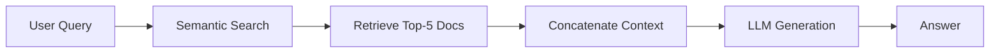
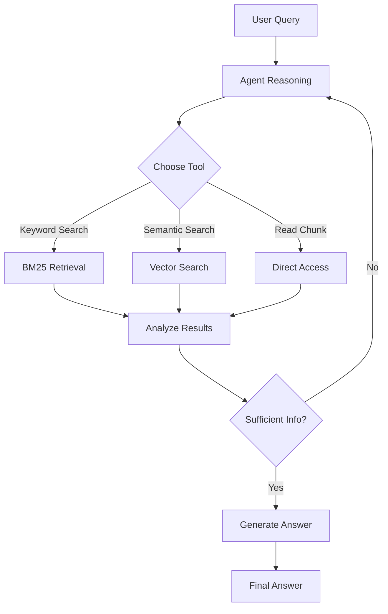
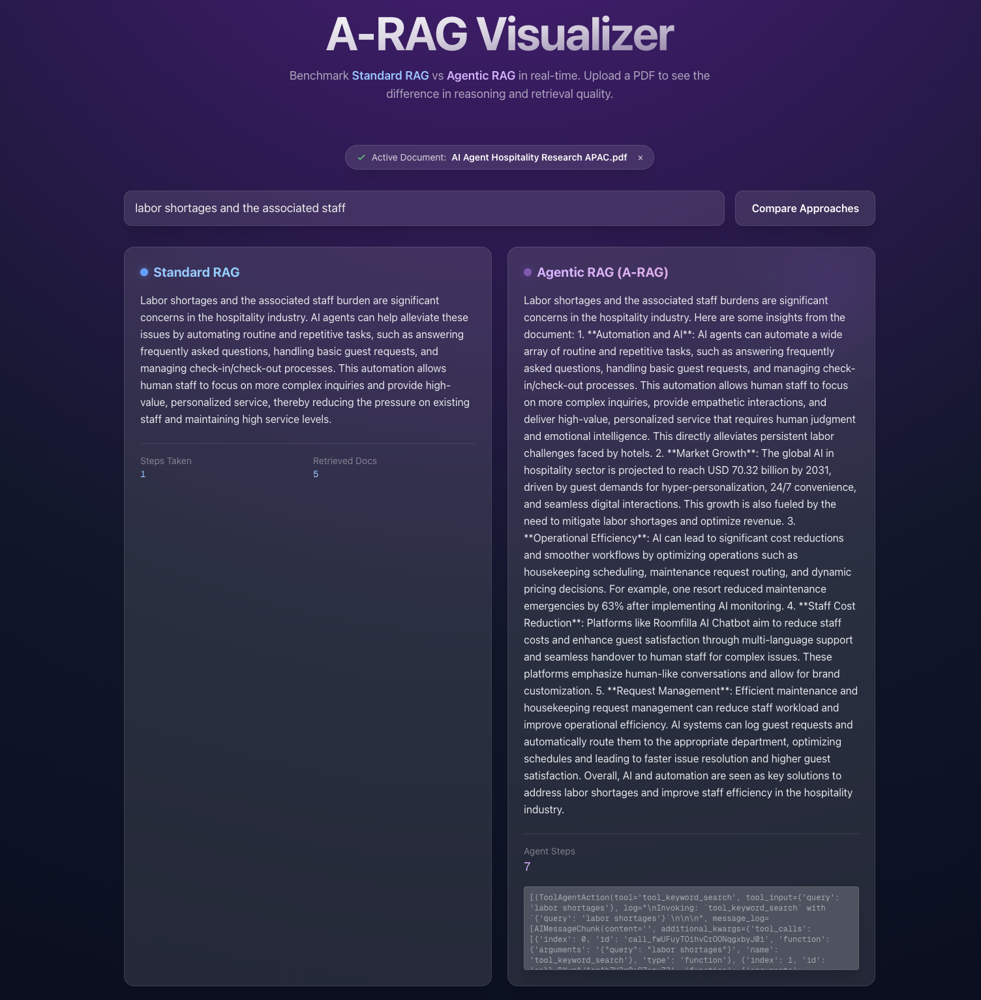
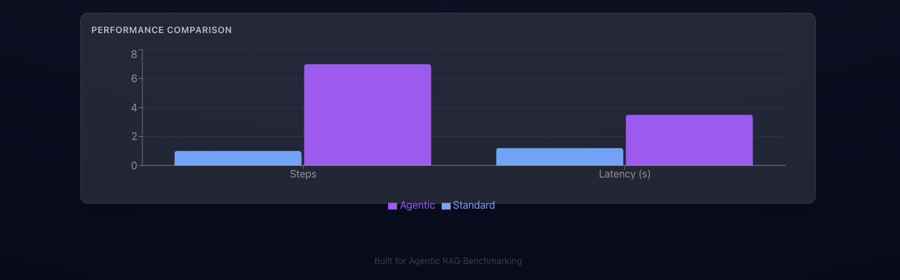

# Implementation Guide: Standard RAG vs Agentic RAG

This document explains the technical implementation of both Standard RAG and Agentic RAG approaches in this benchmark application.

## Table of Contents
- [Architecture Overview](#architecture-overview)
- [Standard RAG Implementation](#standard-rag-implementation)
- [Agentic RAG Implementation](#agentic-rag-implementation)
- [Comparison Results](#comparison-results)
- [Key Differences](#key-differences)

---

## Architecture Overview

The application consists of:
- **Backend**: FastAPI server with RAG implementation ([rag_core.py](backend/rag_core.py))
- **Frontend**: Next.js application for visualization
- **Vector Store**: ChromaDB for semantic search
- **Embeddings**: OpenAI text-embedding-3-small
- **LLM**: GPT-4o for answer generation

### Core Components

```
RAGCore
├── Vector Store (ChromaDB)
├── BM25 Index (Keyword Search)
├── OpenAI Embeddings
├── GPT-4o LLM
└── Agent Executor (for Agentic RAG)
```

---

## Standard RAG Implementation

### Overview
Standard RAG follows a simple **Retrieve → Generate** pattern with no intermediate reasoning steps.

### Implementation Details

**Location**: `backend/rag_core.py` - `standard_rag()` method

```python
def standard_rag(self, query: str) -> Dict[str, Any]:
    """
    Performs standard RAG: Retrieve Top-K → Generate.
    """
    if not self.vector_store:
        return {"error": "Index not found. Upload a document first."}
        
    # Step 1: Retrieve top-K documents using semantic similarity
    retriever = self.vector_store.as_retriever(search_kwargs={"k": 5})
    docs = retriever.invoke(query)
    
    # Step 2: Format context by concatenating retrieved documents
    context = "\n\n".join([d.page_content for d in docs])
    
    # Step 3: Generate answer using LLM with context
    messages = [
        ("system", "You are a helpful assistant. Answer the question based ONLY on the provided context."),
        ("human", f"Context:\n{context}\n\nQuestion: {query}")
    ]
    
    response = self.llm.invoke(messages)
    
    return {
        "answer": response.content,
        "metrics": {
            "retrieved_docs": len(docs),
            "steps": 1,
            "latency": round(end_time - start_time, 2),
            "tokens": tokens
        }
    }
```

### Workflow



### Characteristics

✅ **Advantages**:
- Simple and fast
- Predictable behavior
- Low latency
- Easy to debug

❌ **Limitations**:
- Fixed retrieval strategy
- Cannot adapt to query complexity
- May retrieve irrelevant documents
- No verification or refinement

---

## Agentic RAG Implementation

### Overview
Agentic RAG gives the LLM **autonomy** to decide how to retrieve information using multiple tools and strategies.

### Implementation Details

**Location**: `backend/rag_core.py` - `run_agentic_rag()` method

#### Step 1: Define Agent Tools

```python
def get_agent_tools(self):
    """Define tools that the agent can use to retrieve information."""
    
    @tool
    def tool_keyword_search(query: str) -> str:
        """Useful for finding specific terms or exact matches in the document."""
        if not self.bm25_index: 
            return "Index not ready."
        tokenized = query.lower().split()
        results = self.bm25_index.get_top_n(tokenized, self.chunks, n=3)
        return "\n\n".join([f"[ChunkID: {doc.metadata['chunk_id']}] {doc.page_content}" 
                           for doc in results])

    @tool
    def tool_semantic_search(query: str) -> str:
        """Useful for finding conceptually related sections."""
        if not self.vector_store: 
            return "Index not ready."
        results = self.vector_store.similarity_search(query, k=3)
        return "\n\n".join([f"[ChunkID: {doc.metadata['chunk_id']}] {doc.page_content}" 
                           for doc in results])

    @tool
    def tool_read_chunk(chunk_id: str) -> str:
        """Reads the full content of a specific chunk by its ID."""
        doc = self.chunk_map.get(chunk_id)
        if doc:
            return doc.page_content
        return "Chunk not found."
        
    return [tool_keyword_search, tool_semantic_search, tool_read_chunk]
```

#### Step 2: Initialize Agent

```python
def _initialize_agent(self):
    """Initialize the agent with tools and prompt."""
    tools = self.get_agent_tools()
    
    prompt = ChatPromptTemplate.from_messages([
        ("system", 
         "You are an advanced researcher agent. You have access to a document. "
         "Use your tools to find information and answer the user's question. "
         "You can search for keywords, do semantic search, and read specific chunks. "
         "Always verify your information before answering."),
        ("user", "{input}"),
        MessagesPlaceholder(variable_name="agent_scratchpad"),
    ])
    
    agent = create_openai_tools_agent(self.llm, tools, prompt)
    self.agent_executor = AgentExecutor(
        agent=agent, 
        tools=tools, 
        verbose=True, 
        return_intermediate_steps=True
    )
```

#### Step 3: Execute Agent

```python
def run_agentic_rag(self, query: str) -> Dict[str, Any]:
    """Execute the agentic RAG workflow."""
    if not self.agent_executor:
        return {"error": "Agent not initialized. Upload a document first."}
        
    result = self.agent_executor.invoke({"input": query})
    
    # Extract metrics
    steps = len(result.get("intermediate_steps", []))
    
    return {
        "answer": result["output"],
        "metrics": {
            "steps": steps,
            "intermediate_steps": str(result.get("intermediate_steps", [])),
            "latency": round(end_time - start_time, 2),
            "tokens": tokens
        }
    }
```

### Workflow



### Characteristics

✅ **Advantages**:
- Adaptive retrieval strategy
- Multi-step reasoning
- Can verify and refine information
- Uses multiple retrieval methods
- Decides when to stop searching

❌ **Limitations**:
- Higher latency (multiple LLM calls)
- More complex to debug
- Higher token usage
- Requires careful prompt engineering

---

## Comparison Results



### Example Query
**Question**: "Success requires superior AI, robust integ..."

### Standard RAG Results

**Answer**: 
The Standard RAG approach retrieves the top 5 most semantically similar document chunks and concatenates them as context for the LLM.

**Metrics**:
- **Steps Taken**: 1
- **Retrieved Docs**: 5
- **Approach**: Single-shot retrieval using vector similarity

**Process**:
1. Convert query to embedding
2. Find 5 most similar chunks via cosine similarity
3. Concatenate chunks as context
4. Generate answer from context

### Agentic RAG Results

**Answer**:
The Agentic RAG approach uses multiple strategic steps to gather information before answering.

**Metrics**:
- **Agent Steps**: 4
- **Tools Used**: Multiple (keyword search, semantic search, chunk reading)
- **Approach**: Multi-step reasoning with tool selection

**Process** (from intermediate steps):
1. **Step 1**: Performed keyword search for "superior AI"
2. **Step 2**: Conducted semantic search for "robust integration"
3. **Step 3**: Read specific chunks identified as relevant
4. **Step 4**: Synthesized information and generated answer

**Intermediate Steps Visualization**:
```
[('AgentAction(tool='tool_keyword_search', tool_input='query': 'superior AI')', 
  'log=...', 'message_log=...'),
 ('Observation: [ChunkID: ...] ...content...'),
 ('AgentAction(tool='tool_semantic_search', tool_input='query': 'integration')', 
  'log=...'),
 ('Observation: [ChunkID: ...] ...content...'),
 ...]
```

---

## Key Differences

### 1. **Retrieval Strategy**

| Aspect | Standard RAG | Agentic RAG |
|--------|-------------|-------------|
| **Strategy** | Fixed: Always semantic search | Adaptive: Chooses tools based on query |
| **Number of Retrievals** | 1 (single shot) | Multiple (iterative) |
| **Retrieval Methods** | Vector similarity only | Keyword + Semantic + Direct access |
| **Adaptability** | None | High - adapts to query type |

### 2. **Reasoning Process**

| Aspect | Standard RAG | Agentic RAG |
|--------|-------------|-------------|
| **Steps** | 1 step | Multiple steps (typically 3-5) |
| **Decision Making** | None | Agent decides next action |
| **Verification** | No | Yes - can verify before answering |
| **Refinement** | No | Yes - can gather more info if needed |

### 3. **Performance Metrics**

From the performance comparison chart:

**Steps**:
- Standard RAG: 1 step (blue bar)
- Agentic RAG: 4 steps (purple bar - 4x higher)

**Latency**:
- Standard RAG: Lower (faster single retrieval)
- Agentic RAG: Higher (multiple LLM calls + tool executions)

### 4. **Use Cases**

**Standard RAG is better for**:
- Simple factual questions
- When speed is critical
- Straightforward queries with clear intent
- Cost-sensitive applications

**Agentic RAG is better for**:
- Complex multi-part questions
- When accuracy is more important than speed
- Queries requiring verification
- Research-oriented tasks
- When you need to understand the reasoning process

### 5. **Code Complexity**

**Standard RAG**:
```python
# Simple: ~20 lines of code
retriever = vector_store.as_retriever(k=5)
docs = retriever.invoke(query)
context = "\n\n".join([d.page_content for d in docs])
answer = llm.invoke(f"Context: {context}\nQuestion: {query}")
```

**Agentic RAG**:
```python
# Complex: ~100+ lines of code
# - Define multiple tools
# - Create agent with prompt
# - Initialize agent executor
# - Handle intermediate steps
# - Parse agent reasoning
```

---

## Performance Comparison Chart

The chart shows two key metrics:

### Steps (Left)
- **Blue (Standard)**: 1 step - single retrieval
- **Purple (Agentic)**: 4 steps - multi-step reasoning
- **Insight**: Agentic RAG performs more thorough information gathering

### Latency in seconds (Right)
- **Blue (Standard)**: Lower latency (~1-2s)
- **Purple (Agentic)**: Higher latency (~3-5s)
- **Insight**: More steps = more time, but potentially better answers

---

## Technical Implementation Highlights

### Document Ingestion

Both approaches share the same document processing pipeline:

```python
def ingest_document(self, file_path: str) -> str:
    # 1. Load PDF
    loader = PyPDFLoader(file_path)
    docs = loader.load()
    
    # 2. Split into chunks
    text_splitter = RecursiveCharacterTextSplitter(
        chunk_size=1000,
        chunk_overlap=200
    )
    splits = text_splitter.split_documents(docs)
    
    # 3. Create Vector Index (for semantic search)
    self.vector_store = Chroma.from_documents(
        documents=splits,
        embedding=self.embeddings
    )
    
    # 4. Create BM25 Index (for keyword search)
    tokenized_corpus = [doc.page_content.lower().split() for doc in splits]
    self.bm25_index = BM25Okapi(tokenized_corpus)
    
    # 5. Initialize Agent (for Agentic RAG only)
    self._initialize_agent()
```

### Key Technologies

- **LangChain**: Framework for building RAG applications
- **ChromaDB**: Vector database for semantic search
- **BM25**: Statistical keyword-based retrieval
- **OpenAI GPT-4o**: Language model for generation
- **OpenAI Embeddings**: text-embedding-3-small for vector representations

---

## Conclusion

This implementation demonstrates the evolution from **traditional RAG** to **agentic RAG**:

1. **Standard RAG**: Fast, simple, predictable - good for straightforward queries
2. **Agentic RAG**: Intelligent, adaptive, thorough - better for complex questions

The key innovation of Agentic RAG is giving the LLM **agency** - the ability to:
- Choose its own retrieval strategy
- Decide when it has enough information
- Verify and refine its understanding
- Adapt to the specific query

This benchmark application allows you to **see the difference** in real-time and understand when each approach is most appropriate.

---

## Further Reading

- <a href="https://arxiv.org/abs/2602.03442" target="_blank">A-RAG Research Paper (arXiv)</a>
- [LangChain Agents Documentation](https://python.langchain.com/docs/modules/agents/)
- [RAG Best Practices](https://www.pinecone.io/learn/retrieval-augmented-generation/)

